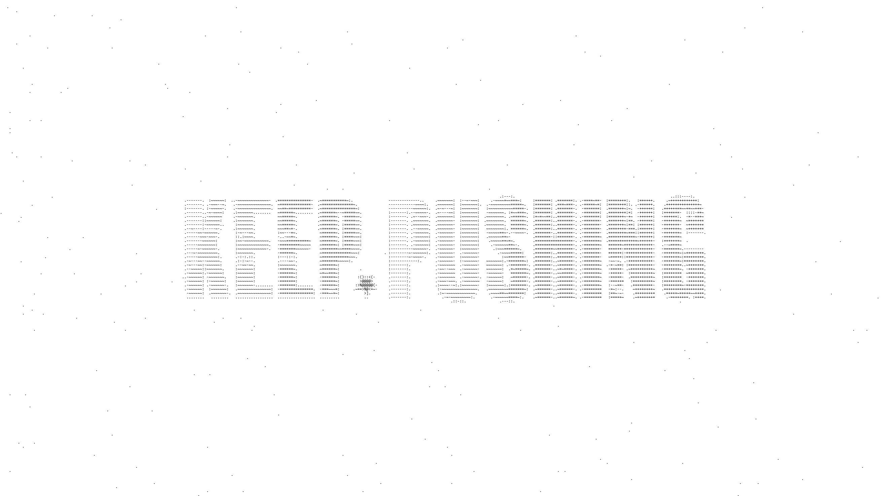
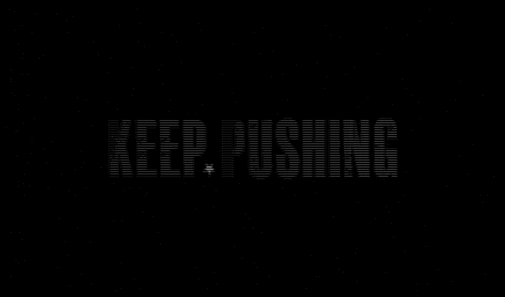
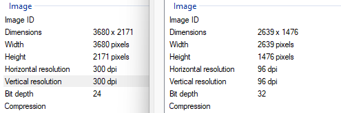

# ASCII TXT → 4K PNG Renderer

<p align="center">

</p>

High-fidelity ASCII renderer that preserves dark backgrounds and produces true 4K PNG output.

## Overview

We all love generating ascii art! But I noticed that most online ASCII converters like https://www.asciiart.eu/image-to-ascii fail to render true black backgrounds.

They often suffer from 

- Washed-out dark backgrounds  
- Low effective resolution  
- Lower DPI export quality
- Inefficient image scaling

This tool eliminates those issues.

It takes a `.txt` ASCII file and renders a properly scaled **true 4K PNG (3840px width)** with accurate monospace alignment and solid black background preservation.

## Features

- True 4K output (3840px width)
- Solid black background rendering
- Accurate monospace font scaling
- 300 DPI export
- Automatic `.txt` and `.png` handling
- Simple CLI

Designed for wallpapers, digital art, and high-quality showcase output.

## Installation

Clone the repository:

```bash
git clone https://github.com/dotpmm/ascii_dark.git
cd ascii_dark
````

Install dependencies (using `uv`):

```bash
uv sync
```

## Usage

1. Visit [https://www.asciiart.eu/image-to-ascii](https://www.asciiart.eu/image-to-ascii)
2. Generate ASCII art with your desired configuration
3. Download the generated `ascii_art.txt`
4. Move the `.txt` file into the project directory
5. Run:

```bash
uv run main.py
```

6. Enter:

   * ASCII file name (no need to type `.txt`)
   * Output image name (no need to type `.png`)

Type `quit` at any time to exit.


## Comparison

### Website Export vs Local 4K Render

<p align="center">
  <table>
    <tr>
      <td align="center">
        <br>
        <strong>Website PNG Export</strong>
      </td>
      <td align="center">
        <br>
        <strong>4K Render (This Tool)</strong>
      </td>
    </tr>
  </table>
</p>

### Key Differences

- True black background preservation
- Higher effective resolution (3840px width)
- Sharper character rendering
- Proper DPI export (300 DPI)
- No background washout


## Detailed Preview

<p align="center">
  
</p>


## License

MIT License